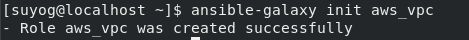
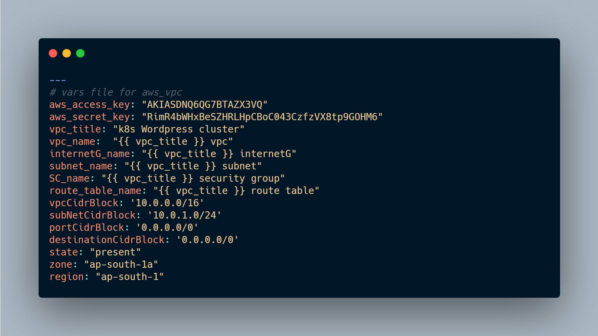
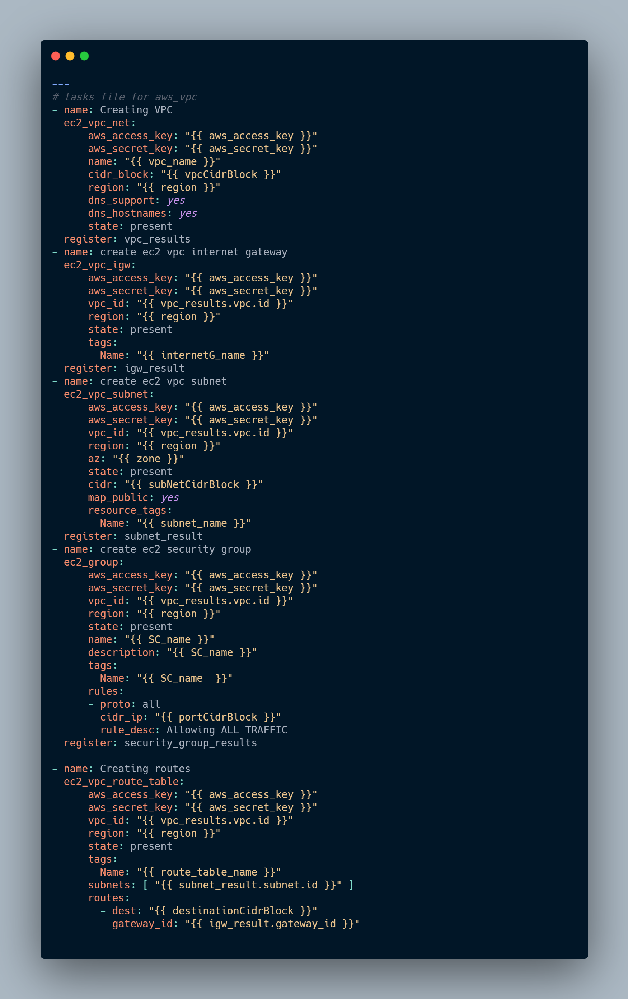

# Using-Ansible-Launching-Wordpress-Mysql-application-on-k8s-cluster
## So in this article i am going to launch a wordpress and application on a kubernetes cluster and automate this whole process using ANSIBLE.
## We are also going to use the dynamic inventory over here.

## Amazon Web Service :
We can define AWS (Amazon Web Services) as a secured cloud services platform that offers compute power, database storage, content delivery, and various other functionalities. To be more specific, it is a large bundle of cloud-based services.

## Kubernetes:
Kubernetes, also known as K8s, is an open-source system for automating deployment, scaling, and management of containerized applications.

## Ansible :
Ansible is the simplest way to automate apps and IT infrastructure. Application Deployment + Configuration Management + Continuous Delivery.

## MYSQL :
MySQL Database Service is a fully managed database service to deploy cloud-native applications.

# Let's Start🏃🏃:

## We Are going to use dynamic inventory.

## Why dynamic inventory?
#### For example, Aws default provides a dynamic IP so, after every restart, it's assigned to a new IP, or we launch a new O.S in a region called ap-south-1 and we need to use all the container as the database from that region and suppose there are 100 servers, Instead of putting it manually in the inventory there is a python script that works as a dynamic inventory which divides the instances with tags, region, subnets, etc.

## First we have to create a Virtual Private Network in AWS for the instances we launch
Amazon Virtual Private Cloud (Amazon VPC) is a service that lets you launch AWS resources in a logically isolated virtual network that you define. ... You can use both IPv4 and IPv6 for most resources in your virtual private cloud, helping to ensure secure and easy access to resources and applications.

## Steps in this Role
### 1. Creating VPC
### 2. Creating VPC InternetGateway
### 3. Creating VPC Subnet
### 4. Creating Security groups
### 5. Creating routes

### We are going to create the role for it

### Writting the variables in aws_vpc/vars/main.yml

### Writting all the task in aws_vpc/tasks/main.yml

