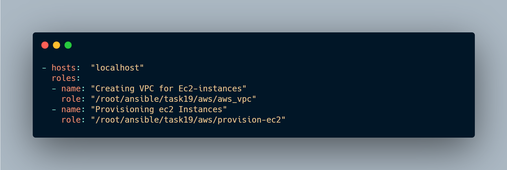
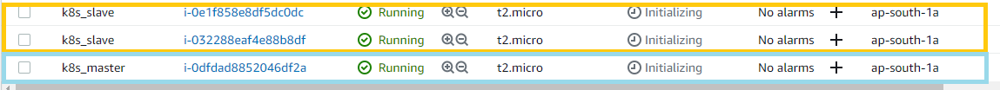

# Using-Ansible-Launching-Wordpress-Mysql-application-on-k8s-cluster-AWSCLOUD(Provisioning)

## So in this article i am going to launch a wordpress and sql application on a kubernetes cluster and automating this whole process using ANSIBLE on AWS CLOUD (Provisioning)
## We are also going to use the dynamic inventory over here.

## Amazon Web Service :
We can define AWS (Amazon Web Services) as a secured cloud services platform that offers compute power, database storage, content delivery, and various other functionalities. To be more specific, it is a large bundle of cloud-based services.

## Kubernetes:
Kubernetes, also known as K8s, is an open-source system for automating deployment, scaling, and management of containerized applications.

## Ansible :
Ansible is the simplest way to automate apps and IT infrastructure. Application Deployment + Configuration Management + Continuous Delivery.

## MYSQL :
MySQL Database Service is a fully managed database service to deploy cloud-native applications.

# Let's Start🏃🏃:

## We Are going to use dynamic inventory.

## Why dynamic inventory?
#### For example, Aws default provides a dynamic IP so, after every restart, it's assigned to a new IP, or we launch a new O.S in a region called ap-south-1 and we need to use all the container as the database from that region and suppose there are 100 servers, Instead of putting it manually in the inventory there is a python script that works as a dynamic inventory which divides the instances with tags, region, subnets, etc.

## First we have to create a Virtual Private Network in AWS for the instances we launch
Amazon Virtual Private Cloud (Amazon VPC) is a service that lets you launch AWS resources in a logically isolated virtual network that you define. ... You can use both IPv4 and IPv6 for most resources in your virtual private cloud, helping to ensure secure and easy access to resources and applications.

## Steps in this Role
### 1. Creating VPC
### 2. Creating VPC InternetGateway
### 3. Creating VPC Subnet
### 4. Creating Security groups
### 5. Creating routes

### We are going to create the role for it

> ansible-galaxy init aws_vpc

### Writting the variables in aws_vpc/vars/main.yml

### Writting all the task in aws_vpc/tasks/main.yml

### VPC Created :
.png)
### Subenet Created :

### Security Groups Created :

## Now let's move to provision the ec2 instances and launch them in the above created VPC
### We are going  to launch one MASTER and TWO slaves for k8s cluster

### Creatining role
> ansible-galaxy init provision-ec2

### Writting the varaibles in provision-ec2/vars/main.yml

###  Writting all the task in provision-ec2/tasks/main.yml

## After this writting a playbook to run both the roles aws_vpc and provision-ec2

## As you can see above we have successfully launced and provisioned the ec2-instances

## Now let's move to the dynamic inventory part
The dynamic inventory will separate the instances according to region, tags, public and private IPs, and many more

### We used two scripts for the dynamic inventory ec2.py and ec2.ini

https://raw.githubusercontent.com/ansible/ansible/stable-1.9/plugins/inventory/ec2.py  ---- ec2.py
https://raw.githubusercontent.com/ansible/ansible/stable-1.9/plugins/inventory/ec2.ini ---- ec2.ini

### Pre-requisites for these scripts are installing boto and boto3 in the system where you are running the program.
To install boto module
> pip3 install boto

> pip3 install boto3

### __To successfully make an API call to AWS, you will need to configure Boto (the Python interface to AWS). There are a variety of methods available, but the simplest is just to export two environment variables:__

>export AWS_ACCESS_KEY_ID='your access key'

>export AWS_SECRET_ACCESS_KEY='your secret key'

### or The second option is to copy the script to /etc/ansible/hosts and chmod +x it. You will also need to copy the ec2.ini file to /etc/ansible/ec2.ini. Then you can run ansible as you would normally.

### We have to only run ec2.py for getting the dynamic inventory.
### __The script separated the instances according to tags "tag_db_k8s_master" and "tag_db_k8s_slave" and made them a separated host group so we can use them in the playbook.__
### __Instead of providing the aws_access_key and aws_secret_key in the playbook, we can configure the AWS CLI and the Ansible will by default use the credentials which we provide while configuring the AWS CLI.__
### Our dynamic inventory is ready to use.

## Now let's Create the role for kubernetes Cluster(Master)

> ansible-galaxy init k8s-cluster

### In the k8s-cluster/vars/main.yml file

## Steps in the below playbook /k8s-cluster/tasks/main.yml

1. Installing docker and iproute-tc
2. Configuring the Yum repo for kubernetes
3. Installing kubeadm,kubelet kubectl program
4. Enabling the docker and Kubernetes
5. Pulling the config images
6. Confuring the docker daemon.json file
7. Restarting the docker service
8. Configuring the Ip tables and refreshing sysctl
9. Starting kubeadm service
10. Creating .kube Directory
11. Copying file config file
12. Installing Addons e.g flannel
13. Creating the token

## Now let's Create the role for kubernetes Cluster(Slave)
> ansible-galaxy init k8s-slave
### In /k8s-slave/vars/main.yml

## Steps in the below playbook /k8s-slave/task/main.yml

1. Installing docker and iproute-tc
2. Configuring the Yum repo for kubernetes
3. Installing kubeadm,kubelet kubectl program
4. Enabling the docker and kubenetes
5. Pulling the config images
6. Confuring the docker daemon.json file
7. Restarting the docker service
8. Configuring the Ip tables and refreshing sysctl
9. Connecting to Master

# ⭐⭐ Cluster is created successfully ⭐⭐

## Now, Launching a Wordpress and mysql applications in the above cluster
### Creating a role to launch the applications

>  ansible-galaxy init mysql-wordpress

## Steps in the below playbook
1. Launching wordpress application
2. Launching mysql application
3. Exposing the wordpress application

### Let's Create a playbook to run both the roles K8s-cluster(Master) and K8s(Slave) 

## Both the cluster and the applications are launced successfully

## After this we can connect to the wordpress application by using  IP of the master or any slave with port assigned to it.
### The mysql-wordpress playbook is written in such a way that it will show the IP and Ports while running
### For example
.png)

## Now,lets take the IP of any node and use it with the above port

## Clients are ready to connect my wordpress website

# Successfully completed the project of launching a wordpress and sql application on a kubernetes cluster and automating this whole process using ANSIBLE on AWS CLOUD (Provisioning)

# HAPPY LEARNING ⭐⭐⭐
